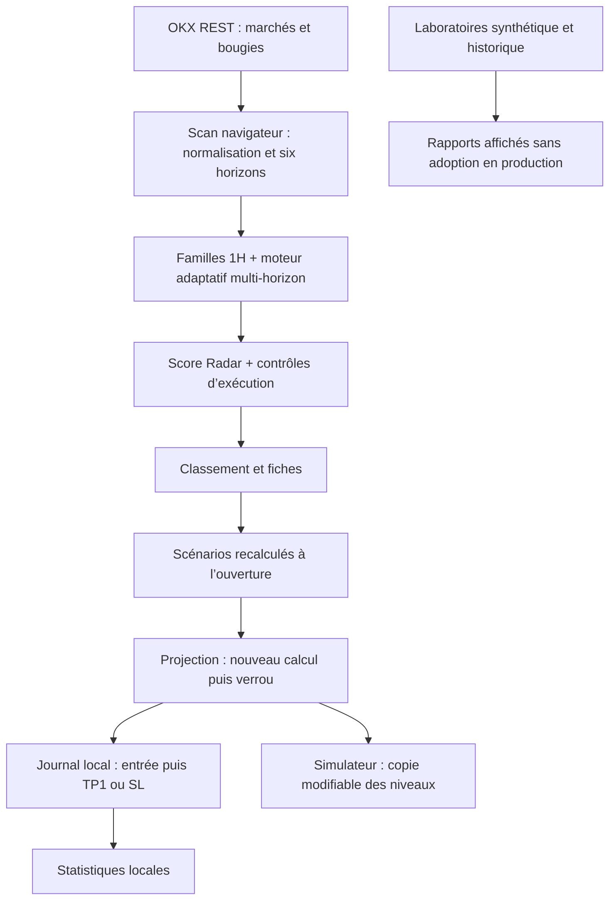

# Institutional Radar — Audit de la baseline V8.9.15

**Étape 1 uniquement · 25 septembre 2026 · Rapport de lecture du code et de vérifications ciblées**

## 1. Conclusion de l’audit

La V8.9.15 possède un véritable radar multi-horizons, une sélection de marchés Spot/X-Perp, des scénarios conditionnels, des niveaux verrouillés, des simulateurs et un journal local. Ce socle mérite d’être conservé. Son identité visuelle beige/bleu sombre/vert constitue la baseline : aucune refonte graphique n’est nécessaire pour traiter les constats de cet audit.

En revanche, **la source de vérité unique reste un objectif, pas encore une propriété du système**. Plusieurs calculs et états coexistent : score de familles, score directionnel, score adaptatif du scénario, score Radar, scénario recalculé, verrou enregistré et observation du journal. Ils ne disposent pas tous des mêmes bougies, règles de confirmation ou exigences de qualité des données.

**Le Learning Engine actuel n’apprend pas à améliorer la production.** Il enregistre certaines projections ouvertes par l’utilisateur, agrège des résultats locaux et expose un laboratoire synthétique ainsi qu’un laboratoire historique. Il ne collecte pas automatiquement tous les candidats, ne surveille pas tous les favoris en continu et ne déploie pas de nouveaux poids. Le laboratoire historique comporte des défauts bloquant son utilisation comme preuve de performance.

Les priorités révélées sont la fiabilité du suivi, la cohérence des bougies et des niveaux, puis la fiabilité des statistiques. Aucun changement de règles n’a été effectué pendant cette mission.

### Périmètre et preuve de baseline

| Élément | Vérification |
|---|---|
| Dépôt | `GenkiDama545/institutional-radar` |
| Commit distant audité | `0eee851e22e2be3651fd6e8b9291b55fe3eda077` — V8.9.15, PR 23 |
| Arbre Git | `36f5a92d8c560bab604686ff31e296bfb6ab3ab4` |
| Copie locale | Historique de commits différent, **même arbre Git exact** |
| Page publique | Index téléchargé depuis GitHub Pages identique octet pour octet à l’index audité |
| SHA-256 index | `591a0bbd1fbaa2dae5f8757964522d7ef50b156221290fa35147db1271786641` |
| Modifications de production pendant l’audit | Aucune ; aucun commit, merge ou déploiement demandé par cet audit |
| Données personnelles de navigateur | Non accessibles : pas d’inspection des favoris/journaux du téléphone de l’utilisateur |
| Limite de vérification | Tests sur données contrôlées ; pas de mesure de rentabilité, de campagne live exhaustive OKX ni de vérification du disque Railway |

**Convention de preuve :** R = anomalie reproduite avec le code réel et des entrées contrôlées ; C = constat établi par lecture du chemin de code ; V = risque nécessitant une validation complémentaire en conditions réelles. Un test reproduisant un défaut confirme le défaut, pas la qualité du comportement.

## 2. Architecture réelle

### 2.1 Application cliente

L’application est une page HTML, sans framework ni compilation du frontend. Six scripts globaux sont chargés dans un ordre fixe. Le navigateur effectue lui-même les appels OKX, les calculs, le rendu et le stockage local.

| Module | Responsabilité réelle | Entrées → sorties | Source de vérité / dépendances |
|---|---|---|---|
| `index.html`, `experience.css` | Structure, sections, navigation, styles et surcharges responsive | État rendu → écrans | HTML initial + chaînes HTML de `app.js` ; CSS inline puis surcharges |
| `app.js` | Orchestration réseau, scan, indicateurs de base, pages, scénarios, suivi, mémoire, laboratoires | API + stockage + interactions → modèles/DOM/localStorage | Variables globales `all`, `current`, verrous et journal ; concentre la majorité des comportements |
| `candle-store.js` | Normalisation REST, pagination, cache historique en mémoire et actualisation de la fin de série | Tableaux OKX → objets OHLCV ordonnés | Champs positionnels OKX ; cache temporaire, pas une base historique persistante |
| `engine-core.js` | Caractéristiques par horizon, niveaux, consensus, contexte, scénarios et scores directionnels | Objets OHLCV + données marché → `F`, niveaux, signaux, scores, setups | Appelle aussi des fonctions définies dans `app.js` : `ema`, `rsi`, `scenarioValid`, etc. |
| `signal-engine.js` | Familles de signaux, régime du modèle 1H, qualité et score Radar | Snapshot marché + `deep` + éligibilité scénarios → scores 0–100 | Distinct du moteur adaptatif multi-horizon |
| `market-screen.js` | File Spot, contrôles de prix/spread/carnet, impact Spot indicatif | Tickers/carnet → ordre de traitement ou admission/refus | Fonctions partagées avec tests ; aucun envoi d’ordre |
| `trade-sim.js` | Simulation linéaire pure, coûts, conversion et estimation de contrats | Saisies manuelles/préremplies → quantité, notionnel, risque, P&L | Fonction `RadarSim.calculate`, indépendante du journal |
| `sw.js` | Cache du shell et des fichiers locaux | Ressources same-origin → secours hors ligne | Stratégie réseau d’abord ; ne collecte pas les marchés ni les scénarios |

Les données de marché ne transitent pas par un serveur applicatif central pour ce parcours. Les calculs s’exécutent dans chaque navigateur. Un autre appareil ne partage donc ni ses scans, ni ses verrous, ni ses observations.

### 2.2 Service Railway distinct

`server/index.mjs`, `monitor.mjs` et `subscriptions.mjs` constituent un **ancien observateur Spot à la minute**, séparé du moteur multi-horizon. Il écoute les trades publics, agrège environ 25 barres par instrument, détecte des poussées, conserve jusqu’à 500 événements et observe leur variation ultérieure à 5/15/60 minutes. Le Dockerfile place l’état dans `/data/radar-state.json`, avec écritures périodiques et remplacement par renommage.

Ce service ne crée pas les scénarios du frontend, ne suit pas leurs SL/TP et n’alimente pas son journal Learning. `hosted-config.js` et `hosted-feed.js` existent toujours dans le dépôt, mais **ne sont pas chargés par l’index V8.9.15**. La persistance Railway n’est donc pas la persistance des scénarios utilisateur.

La documentation du serveur décrit encore un raccordement à « Surveillance continue » qui n’existe plus dans l’index courant. L’activité et les coûts éventuels du service déployé restent une question opérationnelle à vérifier ; aucune suppression ou reconnexion n’est proposée automatiquement.

## 3. Flux réel des données

**Absences de liaison importantes :** le simulateur ne met pas à jour le verrou ; ses sorties partielles ne sont pas suivies par le journal ; les statistiques du journal n’entrent pas dans l’optimisation synthétique ; aucun retour automatique de ces laboratoires ne change le score Radar.

### 3.1 Acquisition et univers

1. Le scan démarre au chargement puis sur « Scanner ». Il récupère tickers Spot, instruments FUTURES et tickers FUTURES.
2. Spot : paires `-USDT`, prix positif et volume de cotation positif pour intégrer la file d’analyse. Les favoris changent l’ordre, pas la profondeur d’analyse.
3. X-Perp : instruments `ruleType=xperp`, `state=live`, nom conforme au motif `BASE-USD_UM_XPERP-…` et ticker disponible. Les SWAP publics restent volontairement hors univers.
4. OI et funding sont demandés contrat par contrat. Un échec laisse une valeur absente, sans inventer une valeur observée. La validité des endpoints/units pour chaque famille réelle de X-Perp doit être testée avec des réponses OKX archivées.
5. Chaque marché retenu reçoit les horizons **5m, 15m, 30m, 1H, 4H, 1D**. Trois marchés sont traités simultanément, avec file réseau cadencée. Il n’existe plus de présélection par poussée de volume 1m.
6. « Complet » signifie au moins 40 bougies par horizon ; « partiel » accepte 1H, un horizon court et un horizon long. Ce critère n’assure ni continuité des timestamps ni fraîcheur de chaque série.
7. Tickers et carnets des candidats sont revérifiés. Spread ≤ 1 % ; pour le Spot, au moins 500 unités de cotation de chaque côté près du prix et impact aller-retour théorique de 100 USDT ≤ 1 %. Pour le X-Perp, volume 24h ≥ 100 000 à défaut de profondeur vérifiée.

Le classement se rafraîchit partiellement pendant le scan. Ensuite, une tâche actualise prix et carnets des candidats environ toutes les 45 secondes lorsque la page est visible. **Elle ne relance pas les six analyses techniques.** Un prix récent peut donc accompagner une structure de scénario issue d’un scan bien plus ancien.

### 3.2 Volume, taille et historique

- `v` des bougies correspond au champ OKX de volume de cotation utilisé par le décodeur ; il ne faut pas le multiplier à nouveau par le prix.
- `medVol` est en réalité la **moyenne transversale** du volume des marchés du même type au scan. `marketMedianVol` est leur médiane. Ce n’est pas une moyenne historique propre à l’actif.
- Le terme « petites cryptos » correspond ici à un rang de **volume 24h**, pas à une capitalisation. Le filtre « taille » n’utilise pas de données de market cap.
- L’historique de scans conserve au maximum 192 échantillons par instrument : timestamp local, OI, prix, volume, funding, score. L’intervalle entre observations dépend des scans ; `oiDelta` compare deux scans, pas deux dates à durée constante.
- Le cache des bougies conserve jusqu’à 4 000 clés instrument/horizon en mémoire. Il réutilise l’historique, recharge la partie récente et reconstruit une fenêtre complète après environ 30 minutes. Il disparaît au rechargement. Il n’alimente pas une collection historique Learning.

### 3.3 Indicateurs et confluence

Indicateurs réellement calculés : EMA20/50, RSI14, StochRSI, Supertrend, ATR, ADX interne, Bollinger, ROC, efficacité, volumes, pivots et groupes de niveaux. La fonction OBV existe mais n’est pas appelée dans le parcours de production.

La « Price Action » du modèle central est essentiellement déduite de `trendState`. Les libellés Doji/engulfing/rejets et HH/HL de la fiche utilisent d’autres petites fonctions de présentation. Ces libellés ne forment pas une batterie complète de détection de structures utilisée telle quelle par le scoring.

Trois pondérations des horizons coexistent : consensus MTF, score directionnel, profils de régime. Les coefficients `REGIME_PROFILES.tf`, ainsi que `priority` et `avoid`, sont définis mais ne pilotent pas le score actuel. Les familles tendance/EMA/Supertrend/Price Action sont additionnées séparément : leur regroupement visuel ne garantit pas la déduplication de l’information.

Le moteur est sensible à la bougie en formation pour plusieurs indicateurs, même lorsque `priceNow` provient de la dernière bougie clôturée. Ce mélange explique des changements de lecture avant clôture ; il doit être documenté et décidé avant toute modification.

### 3.4 Les différents scores

| Valeur | Calcul / rôle réel | Où elle apparaît |
|---|---|---|
| `centralSignalEngine.score` | Confiance agrégée des états de familles ; base 50 ; non directionnelle | Page moteur « Confluence » |
| `qualityScore` | Confiance moins contradictions, avertissements, faible participation et extension | « Tradabilité » du moteur ; 42 % du score Radar |
| `biasScore` | Solde pondéré des familles directionnelles autour de 50 | Page moteur « Biais » |
| `directional.longScore/shortScore` | Six horizons avec poids propres, seuils techniques, ajustements funding/OI et boost SHORT de motif | Radar et scénarios ; conditions d’éligibilité |
| `adaptiveEngine.score` | Base 38, nombre de confluences, alignement/participation, pénalités de contexte | Score du scénario et snapshot du journal |
| `calibratedScore` | 42 % qualité + 26 % direction + 12 % liquidité relative + 10 % sécurité extension + 10 % état de construction | Score Radar et cartes directionnelles |

Le score Radar est plafonné à 57 sans modèle, à 72 pour un setup en formation sans scénario valide, sinon à 63 sans setup ; les analyses partielles sont plafonnées à 63 dans le scan. Les catégories Radar commencent à 78/64/48. Les mots de « terrain » utilisent d’autres seuils : 82/68/52/38. La fiche présente un score « meilleur sens », tandis qu’une carte utilise le score de son sens : un écart est donc possible même sans changement de marché.

La variable `execution` du calcul de score est un bonus pour la construction du scénario, **pas** le résultat du contrôle de carnet. Les vrais contrôles d’exécution sont appliqués séparément à l’admission dans `scenarioCandidates`.

## 4. État exact du système de scénarios

### 4.1 Création : trois objets successifs

**Candidat de scan.** `adaptiveEngine` calcule quatre constructions : breakout LONG, pullback LONG, breakdown SHORT, rejet/reversal SHORT. Entrées/stops reposent sur niveaux groupés et marges ATR ; TP1 combine niveau suivant et risque, TP2/TP3 utilisent surtout des multiples/écarts de risque. Un scénario potentiel n’est ni un ordre, ni un enregistrement de journal.

**Scénario de la page.** `scenarioHtml` recharge six horizons et le marché, puis recalcule les niveaux. Le scénario vu ici n’est pas l’objet du classement. Il peut différer légitimement si le marché change, mais aussi à cause des règles et traitements divergents décrits plus bas.

**Verrou de projection.** Ouvrir la projection recharge encore les horizons, avec des profondeurs différentes. Si aucun verrou n’existe pour `instrument::kind`, la projection construit un nouvel objet et le journalise. Ce n’est qu’à ce moment que l’identité stable apparaît. Cliquer « Garder ce scénario » ajoute ensuite une référence de favori ; la création du journal ne dépend pas de ce clic.

### 4.2 Ce qui est figé

| Objet | Informations conservées | Manques importants |
|---|---|---|
| Verrou | UUID, kind, marché, sens, createdAt, anchorKey/triggerKey, instrumentId, entrée, stop, TP1–3, risque, R/R, score adaptatif, signaux avec détails, confluences | Version moteur/règles, hash de paramètres, contraintes exactes d’activation, données brutes sources, fraîcheur des sources |
| Journal à la création | Schéma V3, ID du verrou, actif/instrument, sens/marché, niveaux, score, noms/états/familles des signaux, confluences, fingerprint, snapshot, phase OBSERVATION | Détails de tous les signaux, tous les indicateurs de chaque horizon, carnets/spread figés, frais/FX/allocation, TP successifs, date d’expiration |
| Snapshot | Prix, variation24h, volume, OI/delta/funding/range, sous-ensemble `deep`, scores, lignes MTF, régime | `deep` provient de `current`/dernier scan ; le reste peut provenir du nouveau moteur. Pas un instantané atomique |
| Favori | Petit snapshot d’actif + mapping kind → ID de verrou | Copie complète indépendante du verrou, version du scénario, export/restauration complète |

Les niveaux du verrou sont bien stables tant qu’on ne demande pas une nouvelle configuration. Cependant le marché courant, les indicateurs recalculés et le libellé d’état ne sont pas figés — ce qui est normal pour suivre, à condition de distinguer contexte initial et contexte courant.

### 4.3 Conditions et résolution

| Phase | Comportement effectivement codé |
|---|---|
| Éligibilité fraîche LONG | Stop < prix courant < entrée < TP1, setup LONG autorisé ; exigences de couverture/exécution supplémentaires dans le Radar |
| Éligibilité fraîche SHORT | TP1 < entrée < prix courant < stop, setup SHORT autorisé et instrument X-Perp pour le parcours UI |
| Activation projection | Prix live au-delà de l’entrée + dernière clôture du déclencheur au-delà + ratio volume ≥ 1,15 + biais compatible + prix non invalidé |
| Début de suivi journal | Au cours d’un rafraîchissement de projection, `journalAdvance` transforme FORMING en ACTIVATED si la dernière clôture est postérieure à la création et si le booléen d’activation transmis est vrai |
| Entrée enregistrée | Prix théorique du verrou, même si la confirmation s’est produite plus loin ; ce n’est pas un fill observé |
| Invalidation avant entrée | Dernière bougie clôturée touche le stop par son high/low → CANCELLED ; priorité à cette annulation sur l’activation |
| Sortie après entrée | Parcours des bougies clôturées ultérieures ; premier SL ou TP1 → CLOSED |
| TP et SL dans la même bougie | Convention prudente : SL prioritaire ; `sameBarAmbiguous=true` |
| TP2/TP3 | Affichés et simulables ; **pas suivis après TP1** dans le journal live |
| Sorties partielles / break-even / trailing | Absents du suivi live |
| Expiration | Pas de règle live d’expiration ; un FORMING peut subsister indéfiniment |
| Réinitialisation utilisateur | Verrou supprimé ; observation ouverte passée en CANCELLED/USER_RESET |
| Trou d’historique | Détection partielle : contrôle du premier timestamp disponible seulement ; des trous internes passent inaperçus |
| Reprise après fermeture | Réévaluation à la réouverture de la projection ; pas de reconstruction fiable de toute l’activation passée |

### 4.4 Surveillance réelle et sauvegarde

Seule la projection ouverte appelle `journalAdvance`, environ toutes les dix secondes et lors de certaines interactions. Les autres scénarios/favoris ne tournent pas en parallèle. Un onglet fermé n’effectue plus ce suivi ; le service worker ne le remplace pas. Le simulateur dédié arrête le timer de projection.

La mémoire est locale à l’origine du site et à l’appareil :

| Stockage | Contenu | Rétention / restauration |
|---|---|---|
| `ir_scan_history_v866` | Historique de scans par instrument | 192 points par instrument ; pas de purge globale des anciens instruments |
| `ir_scenario_locks_v871` | Dernier verrou pour chaque instrument/kind | Pas de plafond explicite ni expiration automatique |
| `ir_favorites_v1` | Actifs favoris et références de verrous | Suppression de favori ne supprime pas forcément verrou/journal |
| `ir_learning_journal_v866` | Observations V3 et éventuels historiques migrés/importés | Derniers 1 500 éléments par ordre du tableau, sans garantie de conserver tous les ouverts |
| `scenarioSimValues` | Saisies des simulateurs | Mémoire JS uniquement, perdues au rechargement |
| Cache de bougies | Objets OHLCV | Mémoire JS uniquement |
| Cache du service worker | Application/fichiers locaux | Pas une sauvegarde du localStorage |

L’export Learning ne comprend que le journal. L’import ne restaure ni les verrous ni les favoris : **exporter le Learning n’est pas une sauvegarde complète des scénarios reprenables**. L’import accepte un JSON très peu validé et écrase les ID identiques. Les versions legacy sont copiées sans conversion de schéma robuste.

### 4.5 Cohérence scénario → projection → simulation → suivi

| Passage | Ce qui tient | Ce qui diverge |
|---|---|---|
| Radar → page scénario | Même famille de fonctions moteur | Recalcul, nouvelles bougies, garde complète moins stricte, direction cliquée non conservée, score SHORT recalculé sans son boost |
| Page → projection | Même kind demandé | Nouveau calcul avant verrou ; moins de bougies sur certains horizons ; niveaux pas transmis comme snapshot sélectionné |
| Projection → simulateur | Niveaux préremplis correctement | Copie modifiable ; pas d’ID canonique partagé dans le simulateur préparé ; changements sans effet sur le suivi |
| Simulateur → journal | Aucun lien écrit | Allocation/frais/levier/FX ignorés par l’observation TP1/SL |
| Verrou → suivi | Niveaux conservés, journal lié par ID | Critères live dépendants du contexte recalculé ; entrée théorique, interruptions, TP1 terminal |
| Suivi → statistiques | Agrégation en unités R et taux par groupe | Filtres de validité différents entre statistiques détaillées et synthèse LONG/SHORT |

## 5. État réel du Learning Engine

### 5.1 Ce qui fonctionne

- `journalCreate` est idempotent pour un ID de verrou déjà présent.
- Des contextes et niveaux sont conservés à l’ouverture des projections.
- `learningStats` agrège les CLOSED V3 activés, avec résultat `CONFIRMED_CANDLE` et R fini : nombre, TP/SL, R moyen, score moyen et dispersion.
- Groupes par sens / marché / régime / kind.
- `learningProposal` calcule des synthèses LONG/SHORT, intervalles de Wilson et drapeaux de taille d’échantillon.
- Export/import JSON local.
- Gouvernance déclarative : observation, tests, pas de modification automatique des règles.

### 5.2 Ce qui n’existe pas encore

Pas de collecte exhaustive des candidats, scheduler persistant multi-scénarios, jeu de features reproductible complet, apprentissage de paramètres depuis le journal, registre de modèles Production/Challenger, promotion/rollback, évaluation prospective indépendante, suivi MFE/MAE live, TP2/TP3 live, expiration live, ni récupération des exécutions réelles.

Le bouton « Proposition d’apprentissage » montre des statistiques ; il ne produit pas un modèle entraîné. Le seuil de 30 résultats et celui de 20 par configuration sont des seuils codés, pas une preuve de suffisance statistique. Des observations du même marché/horizon peuvent être corrélées ; cette dépendance n’est pas traitée.

### 5.3 Trois systèmes distincts portent une idée de laboratoire

| Système | Données | Ce qu’il calcule | Effet production |
|---|---|---|---|
| Mémoire Learning | Journal des projections suivies | Agrégats par sens/configuration, R, taux, Wilson | Aucun |
| Laboratoire gouverné synthétique | 11 cas écrits à la main : 5 DEV, 3 VAL, 3 HOLDOUT | Compare une base et trois jeux de poids prédéfinis via des attentes booléennes | Aucun ; `accepted` est affiché, pas appliqué |
| Laboratoire historique « walk-forward » | Bougies OKX téléchargées à la demande sur un instrument | Découpe 70/20/10, scénarios ponctuels, TP1/SL, coût hypothétique 0,2/0,5 % | Aucun ; résultat seulement dans le DOM |

Le laboratoire synthétique ne lit pas le journal. Sa base d’optimisation est un jeu de poids unitaires, alors que la production utilise des poids de familles/régimes : la comparaison DEV affichée n’est pas une recherche exhaustive du meilleur modèle de production.

Le laboratoire historique ne réalise pas une succession de fenêtres d’entraînement glissantes : il applique un moteur fixe à un découpage temporel. Ses données sont actuellement transmises sous forme de tableaux API alors que `adaptiveEngine` attend des objets OHLCV. Une sonde reproduit un modèle contenant des niveaux `NaN` et zéro setup apparent. **Ses résultats ne doivent pas être utilisés pour valider une stratégie dans cet état.**

Même après correction de ce format, il restera à traiter les clôtures réellement connues à la date du signal, le chevauchement des horizons d’issue entre partitions, les historiques insuffisants sur les petites unités et la différence entre entrée par simple contact historique et activation confirmée live. Cela relève de corrections préalables au Learning, pas d’une autorisation à l’implémenter maintenant.

## 6. Inventaire fonctionnel et UI

Décision principale unique par bloc. KEEP signifie conserver la fonction et son rôle, pas garantir l’absence de tout défaut. REMOVE est une recommandation pour un futur changement validé ; rien n’a été supprimé.

| Bloc | Décision | Justification / destination proposée |
|---|---|---|
| Identité visuelle V8.9.15 et grand titre | KEEP | Baseline demandée ; aucun remplacement global |
| Univers Spot USDT + X-Perp séparé | KEEP | Bon découplage d’instruments ; pas de favoritisme de ticker |
| Analyse identique des six horizons | KEEP | Protège la confluence et l’accès des petits marchés |
| Acquisition OI/funding | DOCUMENT | Couverture réelle, unités, erreurs et durée entre scans à expliciter |
| Normalisation de bougies/cache | IMPROVE | Continuité/fraîcheur/corrections historiques à contrôler ; préserver avantage des lectures récentes |
| Contrôles prix/spread/carnet | KEEP | Séparation pertinente entre signal et exécution ; étendre les preuves de fraîcheur plus tard |
| « Taille » des cryptos | DOCUMENT | C’est le percentile de volume 24h, pas la capitalisation |
| Calcul des indicateurs | IMPROVE | Corriger le contrat ADX et décider une convention de bougies clôturées |
| Familles / régime 1H et régime multi-horizon | MERGE | Harmoniser le modèle de lecture ; pas simplement supprimer un moteur sans tests |
| Scores Radar / direction / scénario | DOCUMENT | Rôles distincts à rendre lisibles avant harmonisation ; préserver valeurs de référence |
| Top 5 | KEEP | Résumé utile ; préciser qu’il est global malgré les filtres d’une autre section |
| « Explorer les scénarios » / catégories | KEEP | Filtres utiles ; labels « confirmé » à distinguer d’« activé » |
| Surveillance multi-horizon | IMPROVE | Motifs LONG moins précis, double affichage de certaines listes SHORT |
| Tableau de tout le marché | KEEP | Utile pour retrouver tous les actifs, y compris sans scénario |
| Tri « OI / Volume » | REMOVE | `oiRatio` n’est pas alimenté en production ; action actuellement sans signification |
| Fiche Résumé | KEEP | Information centrale ; nommer le score et l’âge de son calcul |
| Lecture trader générique | IMPROVE | Beaucoup de texte constant ; relier chaque conclusion aux données de l’actif |
| Radars Prix/Score | KEEP | Valeurs et accès historique utiles |
| Radars OI/Volume/Funding/Momentum | IMPROVE | Plusieurs bornes MIN/MAX sont fabriquées à partir du courant ; leur jauge est presque constante |
| Page Volume approfondie | IMPROVE | Double conversion du volume de cotation par le prix |
| Confluence MTF de la fiche | MERGE | Réutiliser une lecture cohérente des six horizons ; actuellement 30m omis |
| Lecture Doji/HH-HL par horizon | DOCUMENT | Présentation simplifiée, distincte du moteur de structure et sensible à la dernière bougie |
| Graphique de fiche / Prix / approfondi | MERGE | Partager contrôles, données et politique de calcul ; garder les emplacements utiles |
| Graphique approfondi / sélection de bougie | IMPROVE | Conserver style ; correction du refresh, puis zoom/pan/indicateurs en étape 2 seulement |
| Projection de scénario | IMPROVE | Source canonique, état de fraîcheur, confirmation spécifique au kind et suivi cohérent |
| Badges d’indicateurs | DOCUMENT | Affichages informatifs, pas des boutons d’activation/désactivation |
| Simulateur sous graphique approfondi | KEEP | Répond au besoin de projection libre ; indépendant du suivi |
| Simulateur de scénario et indépendant | KEEP | Même calcul pur, gains par allocation ; préciser séparation des hypothèses et observations |
| Scénarios chiffrés | IMPROVE | Éligibilité identique partout, niveaux valides pour tous les TP, conservation du choix utilisateur |
| Favoris | IMPROVE | Références stables et export complet ; ne pas suggérer un suivi permanent |
| Journal utilisateur | IMPROVE | L’écran actuel agrège surtout ; il ne liste pas chaque observation avec sa chronologie |
| Statistiques Learning | IMPROVE | Même filtre de validité partout ; quarantaine des imports/legacy |
| Proposition d’apprentissage | DOCUMENT | Rapport descriptif, pas entraînement ni nouveaux poids issus des observations |
| Tests synthétiques visibles | MERGE | Centraliser les jeux de tests et distinguer diagnostic technique de performance |
| Laboratoire historique | IMPROVE | Format, temporalité, partitions et règles de sortie avant toute confiance |
| Contexte & acteurs | DOCUMENT | BTC/ETH simplifiés et pédagogie ; aucun suivi réel de banques/fonds/baleines |
| Blocs pédagogiques « Apprendre » | IMPROVE | Cartes d’aspect cliquable sans action ; leur donner une fonction ou un aspect statique |
| Glossaire | KEEP | Utile ; préciser CVD/liquidations comme notions non collectées ici |
| Comparateur | IMPROVE | Marché/contrat exact et fraîcheur absents du résultat ; doublons autorisés |
| Navigation basse | KEEP | Accès aux sections de l’accueil ; masquée dans le graphique approfondi, confirmé en navigateur |
| Mode compact | REMOVE | Toggle de classe sans règle `.compact` correspondante ; faux réglage actuellement |
| Effacer l’historique des scans | IMPROVE | Effacement du disque sans vider l’objet mémoire ; historique peut revenir au scan suivant |
| Service worker / versionnage | KEEP | Utile pour PWA ; ne pas confondre shell hors ligne et données live |
| Fonctions mortes et variables orphelines | REMOVE | Après contrôle d’usage, voir section dette technique |
| Connecteur frontend de veille minute inutilisé | REMOVE | `hosted-config.js`/`hosted-feed.js` débranchés ; conserver archive si utile |
| Ancien service Railway | DOCUMENT | Isolé de la baseline ; décider séparément maintien/coût/archivage |

## 7. Registre des bugs, incohérences et risques

**P1** : fiabilité des décisions, observations ou validations ; à traiter avant de s’appuyer sur ces données. **P2** : cohérence fonctionnelle et usages courants. **P3** : clarté, dette et maintenance. Ces priorités n’autorisent aucune correction dans la mission actuelle.

| ID | Priorité / preuve | Constat et conséquence | Localisation |
|---|---|---|---|
| F01 | P1 · R | Le backtest passe des tableaux OKX au moteur d’objets : niveaux `NaN`, zéro scénario possible sans erreur explicite. | `runWalkForwardLab`, `timeframeFeatures` |
| F02 | P1 · R/C | `btSlice` filtre sur ouverture ≤ date, pas clôture ≤ date. Une bougie 1D future peut être connue trop tôt après réparation F01. Évaluation à +18 barres traverse aussi la fin d’une partition. | `btSlice`, `btOutcome` |
| F03 | P1 · R | `learningStats` exclut les anciens résultats ; `learningProposal` les réinclut. Sonde : 0 résultat vérifié mais 1 LONG affichable à +3R. | `learningStats`, `learningProposal` |
| F04 | P1 · R | En FORMING, seule la dernière bougie est examinée : une invalidation sur une bougie antérieure peut être oubliée après interruption, puis le scénario activé. | `journalAdvance` |
| F05 | P1 · R | Le contrôle de trous ne vérifie pas chaque intervalle. Sonde : trois bougies manquantes au milieu, pourtant sortie TP1 comptée CLOSED. | `journalAdvance` |
| F06 | P1 · R | Le rafraîchissement REST du graphique peut être écrasé par l’ancienne bougie de même timestamp. Sonde : réponse à 101, affichage conservé à 100 sans WebSocket. | `graphPage.draw`, fusion `raw`/`data` |
| F07 | P1 · R | ADX est stocké dans `feature.t.adx`, mais des branches du moteur lisent `trigger.adx`/`f.adx`. ADX réel 100, valeur lue `undefined` : bonus, choix du déclencheur et signal ADX non appliqués. | `timeframeFeatures`, `adaptiveEngine` |
| F08 | P1 · R/C | Mélange clôturé/en formation : prix clôturé inchangé, RSI et volume modifiés par la bougie ouverte. Sonde RSI 100 → 1,097 sans nouvelle clôture. | `lastCompleted`, `timeframeFeatures`, `trendState` |
| F09 | P1 · C | La projection exige `e.biasBear` pour tous les SHORT, alors que le moteur autorise des rejets/reversals sans ancrage baissier. Scénario admis mais activation pouvant rester bloquée. | `adaptiveEngine` SHORT, `renderScenarioMonitor` |
| F10 | P1 · C | Texte cassure + retest / défense du support, mais activation générique clôture + volume + biais : aucun automate de retest/défense propre au kind. | `scenarioCard`, `renderScenarioMonitor` |
| F11 | P1 · C | Invalidation annoncée « clôture confirmée » dans la carte, live immédiat dans le moniteur, high/low de bougie clôturée dans le journal. Trois sémantiques. | `scenarioCard`, `monitorTriggerStatus`, `journalAdvance` |
| F12 | P1 · R | `scenarioValid` vérifie surtout entrée/stop/TP1 relatifs ; accepte TP1 négatif SHORT et ignore TP2/TP3 incohérents. Le simulateur est plus strict. | `scenarioValid`, `RadarSim.calculate` |
| F13 | P1 · C/V | La fraîcheur technique n’expire pas globalement. Prix/carnets peuvent être rafraîchis longtemps sur un setup non recalculé ; profondeur/niveaux ne partagent pas un timestamp de décision. | `refreshScenarioMarket`, `scenarioCandidates` |
| F14 | P2 · C | La page scénario écrase `e.directional` par un nouvel appel sans boost SHORT, sans recalculer les booléens de setup associés. Les scores affichés peuvent contredire l’admission. | `scenarioHtml` |
| F15 | P2 · C | Les cartes de scénarios ne sont pas toutes conditionnées par `execution.ok` ; la page peut annoncer aucune proposition principale et afficher des niveaux/projections malgré échec du carnet. | `scenarioHtml` |
| F16 | P2 · C | Scan exige six horizons complets ; page/projection peuvent continuer à partir de deux horizons. Les profondeurs et dates de recalcul changent aussi. | `scan`, `scenarioHtml`, `renderScenarioMonitor` |
| F17 | P2 · C | La direction passée par une carte à `openDetail` n’est pas utilisée ; l’ouverture peut proposer un autre sens/kind. | `configCard`, `openDetail`, `chooseFreshScenario` |
| F18 | P2 · C | Volume déjà en cotation multiplié par `c` dans la page métrique. Exemple : 10 000 USDT à prix 100 affichables comme 1 000 000. | `metricPage`, branche Volume |
| F19 | P2 · C | `oiRatio` jamais alimenté dans le scan : famille positioning neutre et tri correspondant sans valeur ; fixtures de lab pourtant renseignées. | `drawTable`, `centralSignalEngine`, `scan` |
| F20 | P2 · C | Jauges OI avec bornes 0,65×/1,35×, Volume 0,35×/1,8×, Funding 0/2× : positions quasi constantes et « MIN/MAX » non historiques. | `detailAsync`, `radar` |
| F21 | P2 · C | Fenêtre d’indicateurs varie : fiche 180 puis 120 barres, projection calcule sur le nombre visible. Zoom/changement de page peut modifier EMA/RSI au même point. | `detailAsync`, `projectionChart`, `proChart` |
| F22 | P2 · C/V | Gardes asynchrones incomplètes : scénario peut écraser une autre sous-page du même actif ; timer de projection créé après attente même si on a quitté ; timer de fiche pas toujours arrêté au retour accueil/outils. | `openDeep`, `openScenarioMonitor`, `backHome`, `toolPage` |
| F23 | P2 · R/C | Absence d’expiration ; TP1 termine le suivi ; entrer dans le simulateur dédié l’arrête. Limites incompatibles avec un futur Learning complet. | `journalAdvance`, `openScenarioSim` |
| F24 | P2 · C | Import peu validé, clés locales non toutes typées, sauvegardes non transactionnelles. Quota/migration peuvent interrompre l’UI ou laisser verrou sans journal. Export incomplet pour reprise. | stockage, import/export, `saveScenarioLocks` |
| F25 | P2 · C | « LIVE » de projection affiché même si ticker échoue et ancien prix est réutilisé ; ligne de prix du graphique = dernière clôture de sa bougie, distincte du ticker. | `renderScenarioMonitor`, `proChart` |
| F26 | P2 · C | Sélection de contrat sauvegardé validée par motif du nom, pas par l’état live réel du listing au moment de reprise. | `isListedXperp`, `openFavorite` |
| F27 | P3 · C | Familles déclarées « sans double comptage » alors que plusieurs signaux corrélés restent additionnés ; nombre de signaux présenté comme nombre de familles. | `centralSignalEngine`, textes scénario/moteur |
| F28 | P3 · C | « Confirmé », « valide », « prêt », « activé » sont employés pour des étapes différentes. Biais baissier peut être étiqueté DÉFAVORABLE même pour un SHORT. | Radar, moteur, scénarios |
| F29 | P3 · C | Mode compact sans effet CSS ; leçon en cartes sans action ; deux accès contexte répétitifs ; comparateur peu distinctif entre Spot/X-Perp. | paramètres, pédagogie, comparateur |
| F30 | P2 · R/C | Effacer l’historique retire le localStorage sans vider `history`. La prochaine sauvegarde peut remettre les données effacées. | `settingsHtml`, `scan` |
| F31 | P2 · C | Le laboratoire historique accède à `e[kind]` : rejet stocké dans `e.shortRejection`, donc branche rejet non évaluée. Les règles d’entrée historiques ne correspondent pas à la confirmation live. | `runWalkForwardLab`, `btOutcome` |
| F32 | P2 · C | Après boost SHORT, `spread` et `strongest` de `directional` ne sont pas recalculés. Le détail peut exposer des champs issus de deux étapes du score. | `adaptiveEngine`, `directionalAssessment` |

### Risques de données complémentaires à tester

Les contrôles actuels n’assurent pas systématiquement des timestamps non futurs, une cadence continue des bougies ou la validité de toutes les relations OHLC. Le cache suppose que l’historique ancien non rechargé reste stable jusqu’à la reconstruction. Le contrôle ±1 % en cours de scan peut comparer un prix à un prix déjà rafraîchi, plutôt qu’à un snapshot technique immuable. Enfin, le rafraîchissement final des premiers carnets d’un gros scan peut devenir vieux pendant le traitement des suivants.

Ces points sont des risques de robustesse documentés, pas une mesure de leur fréquence réelle sur OKX.

## 8. Dette technique et éléments non exploités

### 8.1 Dette qui gêne la fiabilité

- `app.js` concentre réseau, calcul, persistance, UI et laboratoires, avec beaucoup de HTML en lignes très longues.
- Dépendances circulaires au niveau conceptuel : `engine-core.js` appelle des helpers et règles de `app.js`. Les tests doivent charger des scripts globaux et couper l’initialisation DOM.
- État global mutable : `current`, marché sélectionné, timers, frames et simulateur actif. Pas de contexte immuable par page/requête.
- Pas de schéma partagé strict pour bougies/scénario/observation ; la casse du backtest en est une conséquence concrète.
- Le regroupement des styles dans l’index et des surcharges dans `experience.css` oblige à vérifier la cascade avant toute simplification.
- Pas de workflow de tests dans l’arbre audité ; le déploiement Pages n’équivaut pas à une validation fonctionnelle automatique.
- Les tests synthétiques intégrés à l’UI et les tests Node ne couvrent pas tous les chemins réels ; ils peuvent rassurer alors qu’un branchement est cassé.

### 8.2 Code et données orphelins

| Élément | Constat | Traitement recommandé après validation |
|---|---|---|
| `shortDiagnostics`, `obv`, `lineChart`, `backtestFmt` | Définis sans appel dans le parcours applicatif inspecté | Supprimer ou reconnecter explicitement le diagnostic utile |
| `trValue`, `nearestLevels`, `pctMove`, `clampPrice` | Helpers non appelés | Retirer après tests ; `nearestLevels` plante car utilise `p.highs/p.lows` au lieu de `p.hi/p.lo` |
| `csForHover` | Encore affecté, mais le survol utilise désormais les données locales du SVG | Retirer l’ancien état global |
| `REGIME_PROFILES.tf/priority/avoid` | Métadonnées définies, pas de pondération effective issue de ces champs | Documenter ou enlever ; ne pas les activer silencieusement |
| ADX imbriqué | Calculé mais mal adressé dans plusieurs usages adaptatifs | Réparer le contrat avec tests, F07 |
| `oiRatio` | Utilisé dans score/tri/labs, pas produit par le scan | Retirer le faux usage ou définir explicitement calcul/unités |
| `smaVals` dans ADX (`ap`), `trs` local | Travail calculé sans utilisation finale | Nettoyage/performance après preuve de non-régression |
| `baseVol`, `quoteVol` | Conservés au décodage ; principal moteur consomme `v` | Garder seulement si utile au contrat de données explicite |
| `signalModel` vs `adaptiveEngine.shared/signals` | Vocabulaires et comptes différents pour une lecture dite commune | Harmonisation contrôlée, pas suppression immédiate |
| `sdR`, intervalles Wilson, proposition.configs | Calculs utiles peu ou pas exposés dans l’écran mémoire | Choisir usage effectif ou coût évitable |
| `lastScanPerformance` | Mesures collectées ; durée affichée, autres détails non exposés | Garder pour diagnostic, documenter provenance |
| Schémas TP2/TP3 dans `learningStats` | Compteurs acceptés mais chemin live ferme à TP1 | Ne pas laisser croire que TP2/TP3 sont suivis |
| `openDeep(...,'simScenario')` | Branche héritée sans appel UI trouvé ; texte de préremplissage trompeur pour le formulaire libre | Retirer/fusionner après contrôle des entrées |
| `hosted-config.js`, `hosted-feed.js` | Présents mais déconnectés de l’index | Archiver ou enlever du frontend ; service indépendant à décider séparément |

Les identifiants CSS historiques tels que `analysisTabs` ne justifient pas à eux seuls une suppression : un inventaire complet de sélecteurs doit précéder un futur nettoyage. Aucune conclusion « tout le CSS est inutile » n’est tirée.

## 9. Recommandations priorisées et dépendances

### Lot A — Protéger la baseline avant toute évolution

Conserver le commit et des fixtures représentatives Spot/X-Perp, long/short, petit prix, donnée absente, scénario valide/invalide, captures mobile/desktop et exemples de simulation. Créer un lexique de chaque score, état et timestamp. Ne pas modifier les poids pour compenser un défaut de données.

**Dépendance :** aucune ; ce lot précède toute correction comportementale.

### Lot B — Fiabiliser les observations et la vérité affichée

Traiter séparément, avec validation utilisateur des changements de comportement : F03–F05 sur journal/statistiques ; F06 sur actualisation ; F07–F12 sur contrat de features, bougies, confirmation et niveaux ; F14–F17 sur cohérence du parcours. Associer à chaque correction une fixture avant/après et une justification visible.

**Dépendance :** Lot A. La réparation ADX ou le choix d’exclure la bougie ouverte changera potentiellement des scores : ce n’est pas un simple nettoyage à livrer sans validation.

### Lot C — Étape 2, seulement après accord

La future refonte fonctionnelle des graphiques devra garder le style V8.9.15 et unifier données, warmup, unités et actualisation avant zoom/pan et indicateurs activables. Ne pas créer un nouveau calcul de scénario dans le graphique.

**Dépendance :** contrat de bougies et source de niveaux suffisamment définis ; les règles du moteur restent sous contrôle séparé.

### Lot D — Étape 3, Signal Audit

Étudier ensuite pertinence, corrélation et apport réel des familles et contextes. Les résultats actuels n’autorisent pas à choisir de nouveaux poids. OBV/CVD/flux institutionnels ne doivent pas être annoncés comme actifs lorsqu’ils ne sont pas collectés ou consommés.

**Dépendance :** données et vocabulaire fiables ; laboratoire de validation corrigé avant toute conclusion chiffrée.

### Lot E — Étape 4, instrumentation Learning

Après le Signal Audit : prévoir un snapshot canonique versionné, un identifiant stable, une collecte automatique indépendante des pages ouvertes, une politique d’expiration, une vérification des trous, le suivi MFE/MAE/TP/SL et les variables réellement requises. Définir le stockage et les exports complets avant d’accumuler des observations.

**Dépendance :** Lots B et D. Ne pas massifier le journal actuel en l’état.

### Lot F — Production → Challenger → Validation

Dernière phase seulement : registre de versions, comparaison hors échantillon, garde-fous, promotion approuvée et rollback. Le système actuel ne possède pas cette infrastructure ; ses mentions de gouvernance en sont une intention, pas une implémentation complète.

**Dépendance :** corpus fiable issu du Lot E et protocole de validation réellement indépendant.

## 10. Tests qui doivent protéger la baseline

### 10.1 Vérifications existantes exécutées pendant l’audit

| Commande | Résultat | Ce que cela établit / limite |
|---|---|---|
| `node --check app.js` | Succès | Syntaxe, pas correction métier |
| `node engine.test.cjs` | Succès | Règles, verrous/favoris, journal de base, gates, coûts, scan simulé complet/partiel, couverture de 170 Spot, contrat exact, WebSocket |
| `node hosted-feed.test.cjs` | Succès | Normalisation de l’ancien flux, pas intégration V8.9.15 |
| `node --test experience.test.cjs server/*.test.mjs` | 11 tests réussis | Simulation, conversion, cache, pagination, événements et abonnements du service |

Ces tests passent malgré les défauts reproduits. Ils sont une bonne base, pas une preuve de cohérence bout en bout. En particulier, les tests `btSlice`/`btOutcome` ne testent pas le véritable adaptateur de `runWalkForwardLab`.

### 10.2 Matrice de protection à compléter

| Domaine | Test de non-régression / invariant | Ce qu’il protège |
|---|---|---|
| Univers | Tous les Spot admissibles et tous les X-Perps listés passent les six horizons ; pas de préférence ALLO ou seuil 1m | Intention du radar et petits marchés |
| Instruments | Spot et X-Perp homonymes conservent leur ID exact dans score, page, simulation, favori et journal | Mélange de prix/produits |
| Données | Même normalisation REST/WS/historique ; unités documentées ; aucune bougie future, trou silencieux ou prix non fini | Calculs et backtest |
| Cache | Égalité cold/warm aux frontières de clôture ; corrections du dernier timestamp ; erreurs sans stale présenté live | Accélération sans altération |
| Indicateurs | Valeurs de référence avec warmup fixe ; ADX disponible au chemin attendu ; décision explicite sur bougie ouverte | Scoring reproductible |
| Scores | Fixtures par sens/régime, barèmes et plafonds ; cohérence des champs après boost SHORT | Baseline de confluence |
| Classement | Échec prix/carnet retire la carte ; retour de fraîcheur ne rafraîchit pas artificiellement l’âge technique | Admission réelle |
| Sélection | Clic SHORT → même sens/kind/instrument jusqu’à projection, sans recalcul caché non signalé | Continuité du parcours |
| Niveaux | Prix positifs finis, ordre complet entrée/SL/TP1–3, gate symétrique LONG/SHORT | Scénarios absurdes |
| Confirmation | Tests distincts breakout/retest/pullback/rejection ; avant et après clôture ; biais/volume manquants | Activation fidèle au texte |
| Suivi | Idempotence ; invalidation antérieure ; interruptions FORMING/ACTIVATED ; trous internes ; même bougie SL/TP | Qualité du futur corpus |
| Résolution | TP1 terminal actuel caractérisé ; future extension TP2/TP3/allocation/expiration testée séparément après décision | Pas de changement implicite de définition d’un résultat |
| Simulateur | Exemples 500, SHORT 91,133632→85/83/82 : 10/10/80 = 47,92 ; 0/0/100 = 50,11 ; 0 % = 0 | P&L acquis et lisibilité |
| Coûts/risque | Levier inclus une seule fois ; FX constant explicite ; coûts sur entrée/sorties ; marge insuffisante signalée | Arithmétique cohérente |
| Persistance | Reload, export/import complet, migration, JSON invalide, quota, 1 500 observations avec ouverts, favori ancien | Perte/corruption de données |
| Learning | Même filtre vérifiable dans toutes les synthèses ; legacy/import non vérifié exclu ; aucune mutation des poids | Statistiques honnêtes |
| Backtest | Appel complet sur données API réelles normalisées ; clôture ≤ décision ; historique suffisant ; purge des partitions ; rejet reconnu | Validation utilisable |
| Navigation | Quitter pendant chaque await ; réponse retardée ; timers stoppés ; aucun remplacement d’une autre page | Stabilité mobile |
| Visuel | Captures aux largeurs 360/390/768/1440 ; contraste, tabulation, labels H/L, petits prix et overlays proches | Identité V8.9.15 sans refonte |
| Hors ligne | Shell disponible mais données anciennes marquées ; aucune promesse de suivi serveur | Confiance utilisateur |

Les tests de caractérisation des anciens comportements ne doivent pas pérenniser un bug : une correction approuvée change l’attendu avec une preuve documentée.

## 11. Décision à l’issue de l’étape 1

**Conserver la V8.9.15 comme baseline fonctionnelle et visuelle identifiable.** Elle contient déjà des capacités utiles et une architecture partiellement séparée. Ne pas assimiler cette baseline à une validation de ses statistiques ou de sa performance de trading.

La prochaine décision doit porter sur le périmètre de corrections justifiées et sur l’autorisation de l’étape 2. **Aucune étape suivante n’a été commencée, aucun correctif de production n’a été appliqué pendant cet audit.**

## Annexe A — Sources figées

Tous les liens ci-dessous ciblent le commit audité, pas une branche susceptible de changer.

- [Orchestration, UI, scénarios, journal et laboratoires — app.js](https://github.com/GenkiDama545/institutional-radar/blob/0eee851e22e2be3651fd6e8b9291b55fe3eda077/app.js)
- [Caractéristiques et moteur adaptatif — engine-core.js](https://github.com/GenkiDama545/institutional-radar/blob/0eee851e22e2be3651fd6e8b9291b55fe3eda077/engine-core.js)
- [Familles et score Radar — signal-engine.js](https://github.com/GenkiDama545/institutional-radar/blob/0eee851e22e2be3651fd6e8b9291b55fe3eda077/signal-engine.js)
- [Contrôles de marché — market-screen.js](https://github.com/GenkiDama545/institutional-radar/blob/0eee851e22e2be3651fd6e8b9291b55fe3eda077/market-screen.js)
- [Cache et normalisation — candle-store.js](https://github.com/GenkiDama545/institutional-radar/blob/0eee851e22e2be3651fd6e8b9291b55fe3eda077/candle-store.js)
- [Calcul de simulation — trade-sim.js](https://github.com/GenkiDama545/institutional-radar/blob/0eee851e22e2be3651fd6e8b9291b55fe3eda077/trade-sim.js)
- [Structure et styles initiaux — index.html](https://github.com/GenkiDama545/institutional-radar/blob/0eee851e22e2be3651fd6e8b9291b55fe3eda077/index.html)
- [Surcharges visuelles — experience.css](https://github.com/GenkiDama545/institutional-radar/blob/0eee851e22e2be3651fd6e8b9291b55fe3eda077/experience.css)
- [Ancien service indépendant — server](https://github.com/GenkiDama545/institutional-radar/tree/0eee851e22e2be3651fd6e8b9291b55fe3eda077/server)
- [Tests moteur — engine.test.cjs](https://github.com/GenkiDama545/institutional-radar/blob/0eee851e22e2be3651fd6e8b9291b55fe3eda077/engine.test.cjs)
- [Tests simulation/cache — experience.test.cjs](https://github.com/GenkiDama545/institutional-radar/blob/0eee851e22e2be3651fd6e8b9291b55fe3eda077/experience.test.cjs)

## Annexe B — Sondes ciblées exécutées hors dépôt

Les sondes chargent les fonctions réelles de la V8.9.15 en isolant le stockage et l’initialisation réseau/UI. Aucun fichier du dépôt n’est modifié. Les cas sont volontairement artificiels pour isoler une condition ; ils ne mesurent pas sa fréquence de marché.

| Sonde | Résultat observé |
|---|---|
| `ADX_PROPERTY` | {"actual": 100, "accessedByEngine": "trigger.adx = undefined"} |
| `FORMING_BAR_MIX` | {"closedPrice": 118.2, "rsiBefore": 100, "rsiAfter": 1.0970464135021132, "volumeBefore": 1.0257104194857916, "volumeAfter": 19.992991456844802} |
| `RAW_BACKTEST` | {"modelReturned": true, "breakoutEntry": "NaN", "kind": null} |
| `BACKTEST_CLOSE_TIME` | Bougie 1D ouverte à 00:00 incluse à 01:00 alors que sa clôture à 24:00 est future. |
| `LEVEL_VALIDATION` | TP1 négatif et TP2/TP3 incohérents acceptés. |
| `LEGACY_LEARNING` | {"verifiedStats": 0, "proposalLong": 1, "proposalR": 3} |
| `FORMING_LOST_INVALIDATION` | {"status": "ACTIVATED", "missedEarlierLow": 94, "stop": 95} |
| `INTERNAL_GAP` | {"status": "CLOSED", "outcome": "TP1", "missingBars": 3} |
| `NO_EXPIRY` | FORMING |
| `TERMINAL_TP1` | {"first": "TP1", "afterFurtherBars": "TP1"} |
| `DEAD_FUNCTION` | Cannot read properties of undefined (reading 'map') |
| `GOVERNED_LAB` | {"devCases": 5, "validationCases": 3, "holdoutCases": 3, "accepted": true, "productionWeightsChanged": false} |
| `BACKTEST_UI` | UI affiche zéro setup avec données raw au lieu de signaler le format invalide |
| `GRAPH_REST_STALE` | REST retourne 101, mais la bougie déjà présente écrase cette valeur ; prix graphique conservé à 100. |

### Vérification en navigateur mobile

Chromium, viewport 390 × 844, application locale inchangée, réseau OKX remplacé par des réponses contrôlées et stockage isolé :

- **Actualisation REST du graphique :** valeur initiale 100, nouvelle réponse 101, valeur affichée encore 100. Le défaut F06 est confirmé dans le rendu réel, en plus de la sonde de fonction.
- **Effacement de l’historique :** clé localStorage supprimée, mais un échantillon reste dans l’objet mémoire. Confirmation de F30.
- **Page Apprendre :** sept cartes d’apparence cliquable, aucune action attachée.
- **Navigation basse :** masquée dans le graphique approfondi. L’hypothèse d’un bouton visible pointant vers l’accueil caché n’est donc pas retenue comme bug.
- Aucune exception JavaScript non capturée pendant ces vérifications ciblées.

Ces essais ne constituent pas une campagne complète sur tous les appareils. Ils complètent la lecture du dépôt et les tests existants ; ils n’inspectent ni ne modifient les données personnelles ou l’environnement de production.
