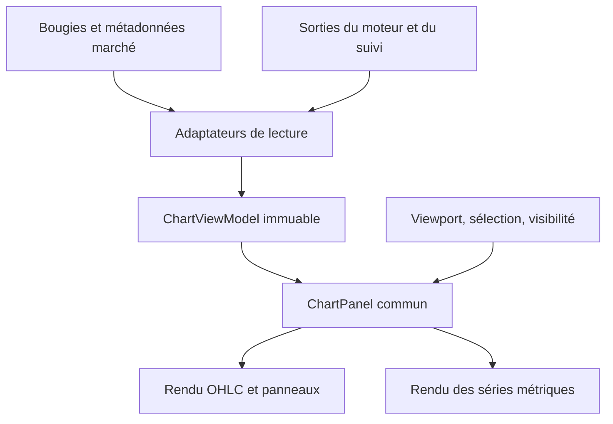

# Institutional Radar — audit des graphiques et architecture proposée

Version examinée : **V8.9.16**. Date : **25 septembre 2026**.

**Statut : proposition à valider. Aucun changement applicatif, commit, merge ou déploiement réalisé pour cet audit.** Aucune intervention sur le Signal Audit, le Learning Engine ou sa future instrumentation.

## 1. Conclusion et périmètre

Les graphiques ne constituent pas quatre implémentations indépendantes : la fiche, la page Prix, le graphique approfondi et la projection utilisent déjà le même générateur SVG, `proChart`. La duplication principale se situe dans leurs chargements, leurs fenêtres de calcul, leurs rafraîchissements et leurs contrôles. Une simple substitution de bibliothèque graphique ne résoudrait pas ces différences.

La cible recommandée est **un composant graphique commun, alimenté par des modèles de lecture explicites, avec des configurations propres à chaque usage**. Son rendu et ses interactions ne doivent appeler ni le calcul des scénarios, ni l’admission, ni le journal de suivi. Les règles métier validées en étape 1 restent inchangées.

Trois sujets doivent être réglés dans cet ordre :

1. Séparer le viewport et les interactions des données de calcul et du cycle métier.
2. Rendre explicites les références des indicateurs, des prix et des niveaux, puis harmoniser les fenêtres de calcul sans modifier celles du moteur.
3. Améliorer navigation, sélection, légende et organisation mobile, dans les couleurs, typographies et surfaces V8.9.16.

**Le simulateur reste sous le graphique approfondi.** Celui du scénario reste également présent, avec les mêmes calculs et une saisie indépendante des rafraîchissements.

### Base de preuve

| Élément | Référence |
|---|---|
| Dépôt inspecté | `GenkiDama545/institutional-radar` |
| Commit de production V8.9.16 | `bd5c19f46eebad03ff8bd1f0d0ca7ef2797fb7c8` |
| Checkout examiné | `dd2b73bb3431ca5fd10fd0cea96a2ca4d56939cc` |
| Arbre commun vérifié | `2a568eafdd38de88572cffc56259f9fb0f3bc8fe` |
| Site concerné | https://genkidama545.github.io/institutional-radar/ |
| Références étape 1 | `docs/audit-v8915/Cloture_Etape1_V8.9.16-rc.1.md`, tests et preuves visuelles associés |

La différence de SHA entre checkout et merge de production ne correspond pas à une différence de contenu : leurs arbres sont identiques. Le répertoire de travail est resté propre.

L’audit repose sur la lecture du code, des sondes déterministes en mémoire avec le harnais existant, et l’examen des captures de validation de la candidate. Ces captures portent encore le badge RC ; le rendu graphique examiné est celui conservé dans la finale. **Ce n’est pas une nouvelle recette tactile ni une validation du flux OKX live en production.** Le problème d’accès réseau du navigateur Work reste une limite distincte ; aucune nouvelle cause de panne réseau n’est déduite ici. L’ensemble de la CI n’a pas été relancé pour cet audit sans modification.

## 2. Inventaire réel

### 2.1 Surfaces graphiques

| ID | Surface et implémentation | Entrées, calculs et rafraîchissement | Interaction actuelle | Décision proposée |
|---|---|---|---|---|
| C01 | Graphique de fiche — `detailAsync`, `#graph1`, `proChart` | 1H, 180 bougies au chargement, puis 120 au rafraîchissement REST de 10 s. Calcul sur les bougies transmises, sans historique séparé. La fiche charge aussi les six horizons décisionnels. | Sélection d’une bougie ; accès au graphique approfondi. | **MERGE** dans le composant commun ; **KEEP** la vue synthétique. Stabiliser la fenêtre au refresh. |
| C02 | Graphique approfondi — `graphPage`, `proChart` | Par défaut 1H/7 jours. Historique visible + warmup de 40 bougies, 60 en 1m, sous plafond total de 1 800. WS bougies et polling REST de 10 s. | TF, période, rechargement, sélection ; simulateur sous le graphique. | **IMPROVE** ; usage principal d’exploration. Partager données et contrôles sans supprimer la page. |
| C03 | Page métrique Prix — `metricPage`, `proChart` | Par défaut 1H/24 h, plafond 1 800, pas de warmup distinct. Recharge à la demande et aux changements de contrôles, sans timer live propre. | TF, période, sélection. | **MERGE** : même expérience Prix que C02, ouverte avec le contexte demandé. Conserver les accès existants. |
| C04 | Projection — `renderScenarioMonitor`, `projectionChart`, `proChart` | Par défaut 15m/90 bougies. Séries décisionnelles et seuils du verrou. REST toutes les 10 s ; calcul des indicateurs sur la seule tranche affichée. | TF, −/+ 30 bougies, reset à 90, sélection ; niveaux et simulateur de scénario. | **MERGE** le rendu, **KEEP** l’usage spécifique et les niveaux immuables ; isoler le cycle métier. |
| C05 | Page Volume — `metricPage`, `lineSvg` | Volume de cotation par bougie (`c.v`), selon TF/période. Aucun indicateur supplémentaire. | Contrôles et rechargement, sans inspection de point. | **IMPROVE** : histogramme, unité et intervalle explicites ; shell commun. |
| C06 | Page Momentum — `metricPage`, `lineSvg` | Variation signée de clôture à clôture, par bougie ; premier point omis. | Idem C05. | **KEEP / IMPROVE** : ligne signée autour de zéro, formule et période lisibles. |
| C07 | Page Open Interest — `metricPage`, `lineSvg` | Échantillons des scans conservés localement, au plus 192 par instrument ; filtre de période. Pas d’historique OI continu fourni par ce graphique. | Période ; boutons TF présents mais sans effet sur ces observations. | **KEEP / IMPROVE** : temps écoulé réel, points observés et trous visibles. Retirer les contrôles inopérants. |
| C08 | Page Funding — `metricPage`, `lineSvg` | `/public/funding-rate-history`, 100 observations maximum, sans pagination ; filtre de période. Nécessite un contrat associé. | Période ; boutons TF sans effet. | **KEEP / IMPROVE** : événements de funding signés, couverture réelle et indisponibilité explicite. |
| C09 | Page Score — `metricPage`, `lineSvg` | Scores des scans locaux, au plus 192 observations ; le filtre `score > 0` retire aussi les zéros. Aucun recalcul de score par cette page. | Période ; boutons TF sans effet. | **KEEP / IMPROVE** : historique d’observations, distinguer zéro et donnée absente. |
| C10 | Six sparklines de fiche — `makeSpark`, `radar` | Prix, OI, Volume, Funding, Momentum, Score. Sources et temporalités différentes ; positions par index. | Pas de sélection ou d’axe ; cartes liées aux métriques. | **KEEP / IMPROVE** : conserver les aperçus utiles, afficher leur contexte et ne pas masquer le signe. |
| C11 | Six jauges de fiche — `radar` | Repères indicatifs, dont OI relatif à sa valeur courante et Funding/Momentum en valeur absolue ; ce n’est pas un diagramme radar de confluence. | Lecture et accès aux métriques. | **IMPROVE** : sens et portée des échelles explicites ; ne pas les présenter comme poids du score. |
| C12 | Barres de score et cartes multi-horizons | Sorties calculées par le moteur et affichées dans le parcours. | Lecture/accès aux détails. | **KEEP** ; ne pas refaire ces calculs dans la couche graphique. |

Les graphiques C01–C04 incluent déjà **prix, volume, RSI et StochRSI**, ainsi que les courbes EMA 20/50 et Supertrend. Les badges « indicateurs affichés » sont des textes, pas des interrupteurs.

### 2.2 Sources et propriétaires

| Donnée | Source actuelle | Propriétaire à conserver |
|---|---|---|
| OHLCV REST | `candle-store.js`, `/market/candles` puis `/market/history-candles` | Le store de bougies ; le renderer ne construit pas d’URL |
| Bougies streamées | `wss://ws.okx.com:8443/ws/v5/business`, canal `candle${bar}` | Session de consultation graphique ; aucun changement des entrées décisionnelles induit par ce stream |
| Prix ticker | `/market/ticker?instId=…`, timestamp propre | Donnée marché horodatée, séparée de la clôture de bougie |
| Indicateurs | Helpers `ema`, `rsi`, `stochRsi`, `supertrend` de `app.js`, utilisés aussi par le moteur | Calculs partagés existants, sans nouvelle formule dans la bibliothèque de rendu |
| Six horizons décisionnels | `DECISION_SPECS`, `candidateModel`, `timeframeFeatures` | Moteur validé V8.9.16 |
| Supports/résistances | `timeframeFeatures(...).levels`, via `clusterLevels` | Sortie du moteur avec son horizon et sa date de référence |
| Entrée/stop/TP | Verrou produit par `scenarioLockFromEngine` | Verrou existant ; jamais dérivé du viewport |
| Confirmation, activation, résolution | État produit par le moniteur et le journal | Suivi existant ; le graphique ne conclut pas à partir d’un franchissement visuel |
| Historique OI/score | Stockage des scans locaux | Historique observé, sans interpolation présentée comme une nouvelle mesure |
| Simulation | `trade-sim.js` et état de saisie de son écran | Calcul pur existant et hypothèses utilisateur, séparés du journal |

Le store REST valide les nombres, l’ordre OHLC et le statut ouvert/confirmé. Il utilise `a[7]` comme volume de cotation, pagine par paquets de 300 et conserve un cache mémoire. Le chemin décisionnel contrôle aussi la continuité et utilise les bougies confirmées. Les graphiques peuvent montrer une bougie en formation : cette différence doit être visible, pas corrigée en changeant le moteur.

### 2.3 Warmups et horizons : la divergence principale

| Usage | Fenêtre affichée | Fenêtre réellement utilisée par les indicateurs |
|---|---|---|
| Fiche | 180 bougies, puis 120 au refresh | Exactement cette fenêtre changeante |
| Prix | Période demandée, au plus 1 800 | Exactement la fenêtre chargée |
| Approfondi | Période demandée, au plus 1 800 | Historique brut avec 40/60 bougies supplémentaires si le plafond le permet |
| Projection | 30–240 souhaitées ; limitées par la série disponible | Seulement les bougies visibles |
| Moteur | 1D/120, 4H/100, 1H/140, 30m/140, 15m/180, 5m/180 demandées | Fenêtres canoniques, puis validation/exclusion des bougies en formation |

L’EMA est amorcée à la première clôture disponible. Le RSI et le StochRSI ont aussi besoin d’un historique. **Même formule ne signifie donc pas même valeur si l’historique ou l’inclusion de la bougie ouverte diffère.**

Le plafond du graphique approfondi porte sur l’ensemble visible + warmup : aux grandes périodes, la réserve de calcul peut disparaître. Le sélecteur −/+ de la projection n’est pas un zoom visuel : il change la tranche de calcul. À 30 bougies, la série StochRSI lissée peut être absente.

Les contrôles ne sont pas uniformes : **30m existe dans la projection et dans le moteur, mais pas dans les contrôles du graphique approfondi**. Le 1m est disponible en consultation ; il ne doit pas devenir un septième horizon de décision.

### 2.4 Calcul et rendu actuels

`proChart` génère entièrement son SVG : prix, volume, RSI 14, StochRSI, EMA 20/50 et Supertrend 10/3. La largeur est dérivée de la fenêtre du navigateur, pas du conteneur. La hauteur interne est de 720 unités, dont 350 pour le prix ; les quatre panneaux sont toujours présents.

Les abscisses sont calculées à partir du rang de la bougie. `lineSvg` et les sparklines font de même : deux observations séparées d’une minute ou d’une heure peuvent être espacées de façon identique. Les valeurs manquantes filtrées ne provoquent pas nécessairement de rupture visuelle.

La sélection de bougie **existe déjà** : timestamp mémorisé, repère vertical, bande de surbrillance, marqueurs High/Low et lecture OHLCV. Elle doit être améliorée, pas annoncée comme une fonctionnalité inexistante. Les cibles tactiles sont néanmoins très fines quand beaucoup de bougies sont visibles ; les panneaux inférieurs et le clavier ne disposent pas d’une inspection équivalente. Il n’y a pas de vrai pan ni de zoom/pinch continu.

## 3. Constats fonctionnels et UX

Priorités ci-dessous : **P1 = préalable à la refonte**, **P2 = cohérence et lisibilité**, **P3 = confort et finition**. Ce registre G01–G19 ne remplace pas les F01–F32 de l’étape 1.

| ID | Priorité | Constat et preuve | Effet | Traitement proposé |
|---|---|---|---|---|
| G01 | P1 | Fenêtres différentes entre C01–C04 ; `projectionChart` transmet la même tranche comme historique visible et de calcul. | EMA/oscillateurs changent avec le nombre de bougies ou l’écran. | **IMPROVE** : contrat de référence commun ; viewport indépendant des séries calculées. |
| G02 | P1 | `zoomScenarioMonitor` et `setScenarioMonitorBar` appellent `renderScenarioMonitor(false)`, qui recharge des données, appelle `candidateModel`, évalue le suivi et passe par `journalAdvance`. | Une action visuelle traverse le cycle métier, même si le verrou existant n’est pas réécrit. | **MERGE / IMPROVE** : séparer rendu et propriétaire du suivi. Aucun changement des règles de confirmation/résolution. |
| G03 | P2 | Le « zoom » est un changement de nombre de bougies ; pas de pan/pinch continu. | Exploration limitée ; nombre souhaité parfois supérieur au nombre disponible. | **IMPROVE** : viewport temporel, chargement antérieur borné, sélection persistante. |
| G04 | P2 | `lineSvg`, `makeSpark` et l’OHLC utilisent des index ; les trous ne sont pas fidèlement représentés. | Durées et lacunes difficiles à lire, surtout pour les scans locaux irréguliers. | **IMPROVE** : positionnement temporel adapté à chaque série ; trous visibles, pas de bougies synthétiques. |
| G05 | P2 | La ligne verte de `proChart` utilise la clôture de la dernière bougie fournie, intitulée « Prix bougie » ; le ticker est ailleurs. | Bougie ouverte, dernière clôture confirmée et ticker restent faciles à confondre. | **IMPROVE** : trois notions distinguées avec source, horodatage et fraîcheur. |
| G06 | P1 | Le filtre des overlays passe par `n(value)` ; `null` peut devenir zéro avant le contrôle numérique. | Niveau nul fictif possible avec données incomplètes/anciennes. | **IMPROVE** : validation stricte des valeurs d’affichage ; indisponibilité explicite, jamais zéro substitué. |
| G07 | P2 | Les statistiques MIN/MAX de `proChart` réutilisent les extrêmes servant à l’échelle, overlays inclus. | Un TP éloigné peut apparaître comme un maximum du cours. | **IMPROVE** : statistiques des bougies et étendue d’affichage séparées. |
| G08 | P2 | Tous les TP influencent l’échelle ; étiquettes longues décalées puis bornées, dessinées avant les bougies. | Prix écrasé, recouvrements possibles sur mobile. | **IMPROVE** : échelle prix par défaut, action « Voir tous les niveaux », labels contextuels et repères hors champ honnêtes. |
| G09 | P2 | Texte `VOLUME • USDT` fixé dans le rendu, malgré des contrats dont la devise diffère. | Unité potentiellement fausse pour certains X-Perps. | **IMPROVE** : métadonnées de l’instrument exact ; ne pas appliquer une conversion implicite. |
| G10 | P2 | Badges non interactifs et tous panneaux actifs. | Surcharge et attente de faux boutons. | **IMPROVE** : vrais contrôles explicites et préférences d’affichage ; calcul métier inchangé. |
| G11 | P2 | 30m absent en approfondi ; TF sans effet sur OI/Funding/Score. | Contrôles incohérents. | **MERGE / REMOVE** : toolbar commune adaptée au type de série ; retirer seulement les contrôles sans fonction. |
| G12 | P2 | Plafonds de chargement ; funding limité à 100 ; couverture approfondie estimée par différence des timestamps d’ouverture. | Période sélectionnée ≠ couverture réelle ; une série quotidienne complète peut être marquée partielle. | **IMPROVE** : début/fin réels, intervalle couvert et limites explicites ; politique d’historique bornée. |
| G13 | P2 | Funding/Momentum utilisent des valeurs absolues dans les aperçus, signées dans leurs pages ; volume 24 h associé à un spark par bougie 1H. | Aperçu et détail ne racontent pas toujours la même chose. | **IMPROVE** : signe et temporalité conservés/nommés ; aucune modification des signaux. |
| G14 | P2 | Readout sans statut ouvert/confirmé explicite ni fuseau ; volume arrondi ; sélection par zones de bougies très étroites. | Vérification précise difficile. | **IMPROVE** : OHLCV précis, heure/fuseau, sélection au timestamp et navigation pas à pas. |
| G15 | P2 | Largeur basée sur `window.innerWidth` ; remplacement complet du HTML au refresh. | Adaptation conteneur imparfaite et gestes fragiles pendant les mises à jour. | **IMPROVE** : resize du conteneur et mises à jour incrémentales sans détruire l’interaction. |
| G16 | P2 | Validation WS moins stricte que REST ; throttle sans rendu final garanti pour un dernier message rapproché ; polling actif même avec WS sain. | Parité des entrées à protéger ; statut « fallback seulement » inexact ; update parfois retardé. | **IMPROVE** : contrat de validation commun et statut réel ; conserver d’abord la stratégie réseau, l’optimiser seulement avec preuve. |
| G17 | P1 | Verrou sans série historique complète ni zones ; supports/résistances disponibles dans le modèle courant, pas dans le verrou. | Risque de présenter une structure actuelle comme celle qui a produit le scénario. | **KEEP / DOCUMENT** : origine et date visibles ; aucune reconstruction fictive. |
| G18 | P2 | Erreurs de rafraîchissement de fiche avalées ; états vides génériques inadaptés aux diverses sources. | Ancien graphique susceptible de paraître actuel ; conseil de relancer un scan parfois sans rapport. | **IMPROVE** : conserver les données avec âge/erreur visibles ; message propre à chaque source. |
| G19 | P3 | Score `> 0` et filtres de valeurs absentes avant le tracé. | Zéro perdu et continuité artificielle possible. | **IMPROVE** : zéro valide conservé ; lacunes distinguées sans inventer de mesure. |

### Sondes locales : résultats vérifiables

Ces résultats proviennent de séries synthétiques du harnais existant ; ils ne décrivent pas une performance de marché.

| Sonde | Résultat observé | Conclusion limitée |
|---|---|---|
| Même dernière bougie, EMA 50 sur 30 / 90 / 120 / 180 bougies | 116,481089 / 115,749466 / 115,712961 / 115,690786 | Changer la fenêtre de calcul change bien l’indicateur au même instant. |
| Même série, StochRSI avec 30 bougies | K/D absents ; présents avec 90 | Le zoom actuel de projection peut supprimer un indicateur. |
| Plus haut réel 118,750202 ; overlay TP3 à 150 | MAX du composant : 150 | G07 reproduit. |
| Overlay avec `value: null` | Label de niveau à 0 $ généré | G06 reproduit sur entrée incomplète. |
| Trois points aux instants t, t+1 min, t+61 min | Positions x = 78, 480, 882 | L’axe de `lineSvg` ne représente pas les durées réelles. |

## 4. Scénario, structure et prix : ce qui peut être dessiné

### Overlays de scénario

Le verrou contient notamment instrument, marché, direction, kind, date, horizon déclencheur, entrée, stop, TP1/2/3, risque et éléments de score/confluence. Ces valeurs doivent être consommées telles quelles.

| Élément demandé | Information réellement disponible | Représentation proposée |
|---|---|---|
| Entrée / déclencheur | `lock.entry` | Une ligne exacte, unité/précision du contrat, origine « scénario verrouillé » |
| Confirmation | Un état et une règle de confirmation autour du seuil ; pas un deuxième prix indépendant | Label d’état fourni par le moniteur, éventuellement marqueur d’événement daté ; **pas de deuxième seuil inventé** |
| SL / invalidation | `lock.stop`, avec signification liée à la phase | Une ligne, intitulé adapté à la phase ; ne pas fabriquer deux prix distincts |
| TP1 / TP2 / TP3 | Niveaux verrouillés | Trois niveaux consultables ; labels hiérarchisés et masquables |
| Activation / résolution observée | Timestamps du journal quand présents | Marqueurs optionnels « observé », jamais « ordre exécuté » |
| Support / résistance | Niveaux ponctuels de `F[tf].levels` | Lignes optionnelles, horizon et date d’analyse visibles |
| Zones de support/résistance/retest | Pas de bornes et de temporalité de zone exposées comme résultat canonique | **Ne pas implémenter actuellement** ; absence explicitée si nécessaire |

Le regroupement de pivots du moteur fournit des niveaux et un nombre de regroupements. La tolérance de regroupement n’est pas une zone de trading exposée avec des bornes. Certaines valeurs ont aussi un fallback par extrêmes ; l’objet ne fournit pas aujourd’hui un marqueur complet de provenance de ce fallback. Dessiner arbitrairement une bande `niveau ± ATR` créerait une interprétation supplémentaire : **exclu**.

Les pivots intermédiaires ne sont pas tous exposés dans le modèle final avec leur temps. Le graphique ne doit pas rappeler une détection de pivots pour combler cette absence. Les montrer nécessiterait d’abord un contrat de sortie explicite, à arbitrer séparément.

Le verrou et le snapshot du journal ne conservent pas une copie complète de l’historique et des supports/résistances de création. Un niveau du modèle courant doit donc porter « structure actuelle », jamais « structure du scénario à sa création ». Pour une ancienne observation sans preuve disponible, la valeur de référence reste indisponible.

Enfin, le suivi actuel ne doit pas être étendu par le dessin : afficher TP2/TP3 ne signifie pas qu’ils sont déjà suivis comme des résultats observés. La machine existante d’observation TP1/SL et ses limites restent la référence.

### Les trois prix

- **Ticker** : dernier prix marché reçu, horodaté et qualifié selon les règles de fraîcheur existantes. Sans ticker fiable, afficher son indisponibilité/âge.
- **Bougie en formation** : clôture courante de cette bougie, explicitement provisoire.
- **Dernière clôture confirmée** : clôture de la dernière bougie confirmée du timeframe affiché.

La barre de lecture montre ces notions séparément. Pour éviter trois lignes concurrentes, la ligne ticker peut être principale quand elle est disponible ; les autres valeurs restent dans la lecture et leurs lignes deviennent optionnelles. Aucun franchissement de ligne ne modifie de lui-même l’état du scénario.

## 5. Architecture cible

### 5.1 Composant commun, propriétaires distincts



Il n’y a volontairement **aucune flèche de retour du graphique vers le moteur ou le journal**.

| Bloc proposé | Responsabilité | Ce qu’il ne fait pas |
|---|---|---|
| `ChartDataSession` | Instrument exact, TF, séries REST/WS de consultation, pagination, qualité et fin de session | Pas d’admission, de score ou de mutation de verrou ; pas de transfert implicite du stream graphique vers les données décisionnelles |
| `AnalysisReadModel` | Exposer les entrées/résultats existants, leur fenêtre, leur date et leur référence de calcul | Aucun nouveau signal ou changement de pondération |
| `ScenarioReadModel` | Copier les niveaux verrouillés et lire l’état/les événements déjà produits | Ne détermine ni confirmation, ni SL atteint, ni expiration |
| `ChartViewModel` | Données prêtes à dessiner : timestamps, séries, unités, overlays validés et provenance | Pas de `fetch`, de stockage métier ou de calcul de scénarios |
| `ChartViewState` | Période visible, sélection par timestamp, panneaux visibles, mode suivi du dernier cours | Aucun lien implicite entre zoom et fenêtre d’analyse |
| `ChartPanel` | Toolbar, légende, readout, rendu, accessibilité, messages d’état | Ne reconstruit pas le moteur avec des indicateurs de bibliothèque |
| Hôte simulateur | Garder la saisie sous C02/C04 et appeler `trade-sim.js` | Ne réécrit pas les niveaux du verrou et ne se réinitialise pas au zoom/refresh |

Un petit ensemble de modules graphiques suffit. Aucune migration globale vers un framework ni extraction massive de `app.js` n’est nécessaire. Le propriétaire actuel du scénario garde les actions de création/réinitialisation, son rafraîchissement et son suivi. On sépare son rendu au lieu de remplacer sa logique métier.

Les chargements tardifs restent protégés par instrument, timeframe et révision de page. Les données WS et REST conservent la règle validée en étape 1 : une réponse ancienne ne doit pas écraser un message plus récent reçu pendant sa requête.

### 5.2 Contrat des indicateurs et warmups — arbitrage important

**Règle ferme recommandée : changer le viewport ne recalcule aucun indicateur et ne change aucune valeur à timestamp et version de données identiques.** L’historique nécessaire au calcul est distinct de l’historique visible. Les fonctions mathématiques existantes restent uniques ; la bibliothèque de dessin reçoit des séries, pas une consigne d’analyse.

Il serait incorrect de décider simplement « 300 bougies partout » : cela ne reproduirait pas les fenêtres canoniques actuelles du moteur, et changer celles-ci modifierait les décisions. Les six `DECISION_SPECS`, ainsi que l’ordre sélection de fenêtre/exclusion des bougies ouvertes, doivent rester inchangés.

Deux besoins différents doivent être nommés :

| Référence | Données et garantie | Limite |
|---|---|---|
| **Référence moteur** — recommandée par défaut pour la projection et la vérification d’un scénario | Exactes entrées confirmées et version d’analyse du moteur ; même amorçage, mêmes helpers, correspondance vérifiée au timestamp décisionnel | Le moteur ne conserve pas nécessairement une longue série historique ni l’analyse de création d’un ancien verrou. Hors couverture vérifiable : indisponible, sans reconstruction présentée comme une preuve. |
| **Consultation historique** — maintien possible de l’usage approfondi | Même calcul mathématique partagé, fenêtre de calcul explicite et indépendante du viewport ; série calculée une fois par version de données, pas par geste | Une longue fenêtre n’est pas identique à la fenêtre de décision actuelle. La légende ne doit pas faire passer sa valeur pour celle ayant déterminé le score/scénario. |

**Recommandation : conserver les deux usages, avec une référence clairement indiquée, et ouvrir la projection sur la référence moteur.** Ce sont des séries de présentation alimentées par les calculs existants, pas deux moteurs de décision. Aucun score, signal ou niveau ne provient du mode historique.

Si l’on exige au contraire une valeur d’indicateur strictement identique au moteur en tout point de toutes les pages, il faut accepter des courbes absentes hors de la fenêtre réellement vérifiable. On ne peut garantir à la fois cette égalité et une longue courbe historique avec un amorçage différent. **Ce choix doit être validé avant le lot warmup.**

Le préchargement de données anciennes ne doit pas réamorcer silencieusement une série déjà consultée : conserver sa référence de calcul ou annoncer une nouvelle version de consultation. Une actualisation due à une nouvelle bougie est un événement de données, distinct d’un geste de zoom. Le 1m reste explicitement une consultation, sans décision moteur 1m.

### 5.3 Choix du renderer

**Candidat recommandé : Lightweight Charts pour OHLC, volume et panneaux d’indicateurs, sous réserve d’un prototype limité après accord.** Les séries et overlays seraient fournis par nos adaptateurs. Aucun widget hébergé, flux TradingView, indicateur tiers ou remplacement du moteur OKX n’est proposé.

Cette bibliothèque fournit pan souris/tactile, pinch/zoom et panneaux, ce qui évite de réimplémenter toute la mécanique gestuelle. Mais son échelle logique utilise des index : elle ne résout pas à elle seule la représentation des intervalles irréguliers des scans. La session doit expliciter les trous des séries régulières ; les séries OI/Score/Funding doivent garder un positionnement selon leurs timestamps réels.

Recommandation de rendu :

- OHLC et indicateurs : renderer spécialisé, derrière une interface indépendante de la bibliothèque.
- Métriques irrégulières : rendu temporel simple partagé, éventuellement SVG, sous le même shell et avec les mêmes conventions d’inspection.
- Sparklines : conserver le SVG léger, avec des données/sémantiques corrigées ; inutile d’instancier une bibliothèque complète pour chaque aperçu.

La fusion concerne le **contrat, l’interaction et les conventions**, pas l’obligation de dessiner chaque mini-graphique avec le même outil.

Conditions avant adoption : identité visuelle démontrée, gestes mobiles testés, overlays et sélection exacts, version figée et fichiers servis avec l’application, licence/attribution respectées, pas d’agrégation masquant les bougies. L’attribution requise doit être intégrée proprement, pas supprimée. Si ce prototype échoue, conserver le renderer SVG derrière le même contrat ; ne pas basculer la production par défaut.

## 6. Proposition UX, sans nouvelle identité visuelle

### Informations essentielles, optionnelles, détaillées

| Niveau | Contenu | Présentation proposée |
|---|---|---|
| Essentiel | Instrument/contrat, TF, période réelle, bougies, temps, volume, source et fraîcheur du prix | Accès immédiat ; titre et état compacts, surface utile consacrée au cours |
| Essentiel au scénario | Entrée, SL/invalidation, TP1 et état reçu du moniteur | Repères stables ; origine « verrouillé » ; un seul prix quand entrée et confirmation partagent le seuil |
| Optionnel courant | EMA20/50, Supertrend, TP2/TP3, dernière clôture, structure du TF sélectionné | Contrôles explicites ; légende avec couleur, nom et paramètres ; visibilité mémorisée |
| Optionnel en panneau | RSI, StochRSI | Panneaux ouvrables/fermables ; éviter deux oscillateurs imposés sur petit écran |
| Détail | Couverture, référence de calcul, statut ouvert/confirmé, paramètres, autres horizons structurels | Section dépliable, disponible sans occuper en permanence la zone graphique |

Les couleurs beige/bleu sombre, vert/rouge, les cartes arrondies, la typographie et les conventions de navigation restent celles de V8.9.16. Les changements se limitent à l’organisation et aux contrôles de la zone graphique. Aucun écran global ni classement n’est redessiné.

Les couleurs des séries existantes peuvent être conservées ; leur nom et leurs paramètres doivent aussi être lisibles, sans dépendre uniquement de la couleur. Un état caché doit être distingué d’une série indisponible.

### Desktop

- Survol : réticule synchronisé entre panneaux et lecture OHLCV de la bougie la plus proche.
- Clic : fixe la sélection ; elle reste attachée au timestamp au prochain refresh.
- Glisser : déplacement horizontal ; molette/trackpad pour zoomer autour du point visé quand le graphique est engagé, sans capturer systématiquement le scroll de la page.
- Clavier : bougie précédente/suivante, zoom, retour au dernier cours, sortie de l’inspection ; commandes nommées et focus visible.
- Boutons distincts « Dernier cours », « Réinitialiser la vue » et « Voir tous les niveaux ». Aucun ne réinitialise le scénario.

### Mobile

- Tap : sélection précise avec bande verticale visible, repères H/L et lecture au-dessus du tracé, hors du doigt.
- Boutons précédente/suivante d’au moins 44 px pour ajuster d’une bougie.
- Glissement horizontal : pan ; scroll vertical de la page préservé. Mode inspection explicite ou appui long pour déplacer le réticule sans ambiguïté.
- Pinch à deux doigts dans la zone graphique ; pas de désactivation globale des gestes/accessibilité du navigateur.
- Toolbar compacte : TF, période et indicateurs accessibles, sans deux rangées permanentes de gros boutons pour toutes les périodes.
- Proposition de départ à tester : prix d’environ 300–360 px, volume 60–80 px, oscillateur optionnel 80–100 px. La taille suit le conteneur et l’orientation, sans échelle arbitrairement étirée.
- Simulateur directement après le graphique approfondi, toujours disponible ; ses champs restent stables pendant l’exploration.

Le graphe peut suivre le dernier cours lorsque l’utilisateur est à droite. Dès qu’il explore le passé, les nouvelles bougies ne le ramènent pas de force au présent.

### Axe, inspection et niveaux

Les timestamps sont la clé commune des sélections, bougies et événements. Le fuseau est explicite ; la conversion sert uniquement au formatage. Aux longues périodes, afficher dates/jours ; au zoom fin, heures/minutes. Pour les séries irrégulières, l’espace représente le temps écoulé, pas le numéro du scan.

La lecture expose date/heure, OHLC avec précision du contrat, volume/unité et statut ouvert/confirmé. Le volume peut être abrégé sur l’axe, mais sa valeur précise doit être accessible dans l’inspection. Les valeurs des indicateurs sélectionnés se rapportent au même timestamp et à leur référence déclarée.

Les niveaux structurels sont optionnels et limités à un horizon clairement nommé. Les niveaux éloignés ne doivent pas écraser les bougies : afficher un repère « hors champ » avec valeur exacte, ou utiliser « Voir tous les niveaux ». Ne pas déplacer visuellement un TP à un autre prix pour faire entrer son label.

## 7. KEEP / MERGE / IMPROVE / REMOVE consolidé

| Décision | Périmètre précis | Justification et limite |
|---|---|---|
| **KEEP** | Identité V8.9.16, emplacements fiche/profond/scénario, six horizons décisionnels, univers Spot/X-Perp | Baseline validée et usages distincts conservés |
| **KEEP** | Sélection existante, niveaux verrouillés, règles de fraîcheur/suivi, deux simulateurs | Améliorer la lecture sans remplacer la source de vérité |
| **KEEP** | Helpers d’indicateurs et `trade-sim.js` | Pas de formule alternative ni de nouveaux calculs stratégiques |
| **MERGE** | C01–C04 : shell, contrat de données, formatage, sélection, gestion du viewport et rendu OHLC | Supprimer les divergences de présentation, conserver des profils d’usage |
| **MERGE** | Page Prix et approfondi comme deux points d’entrée d’une même expérience | Éviter deux politiques de chargement/indicateurs pour le même cours |
| **MERGE** | Légendes, unités, erreurs, couverture et contrôles des pages métriques | Comportements homogènes sans forcer les séries irrégulières sur un axe inadapté |
| **IMPROVE** | G01–G19, selon priorité et tests | Corrections de fidélité graphique, gestes et lisibilité ; arbitrages explicités avant implémentation |
| **REMOVE** | Boutons TF sans effet sur OI/Funding/Score ; qualification trompeuse d’un simple changement de tranche comme zoom | Retrait de contrôles sans valeur, pas de données ni de fonctionnalités utiles |
| **REMOVE** | Chemins de rendu remplacés devenus sans référence ; CSS graphique orphelin après migration | Seulement après recherche exhaustive des appels, routes, handlers HTML et tests |
| **NE PAS AJOUTER** | Zones/retests calculés par le graphique, confirmation ou résolution déduite visuellement, nouveaux poids/signaux | Informations non fournies par la source canonique ou hors périmètre |

Il n’est pas justifié de supprimer maintenant tout `lineSvg`, `radar` ou toutes les sparklines. Ces fonctions ont des usages actifs. Leur devenir dépend de la migration effective et de l’utilité conservée ; aucune suppression spéculative.

## 8. Risques et protection de la baseline

| Risque | Protection / test nécessaire |
|---|---|
| Interaction qui modifie le moteur ou le journal | Figement des sorties de score, admission, niveaux et verrou ; zoom/pan/toggle/sélection ne les mutent pas et ne provoquent pas d’écriture de suivi. Le timer métier conserve ses tests propres. |
| Warmup silencieusement changé | Même série, même référence, même timestamp : mêmes valeurs sur C01–C04. Zoom sans variation ; préchargement antérieur sans réamorçage silencieux. Tests de correspondance au snapshot moteur. |
| Confusion bougie ouverte/décision | Fixtures confirmées/non confirmées ; bougie provisoire visible mais décisions identiques à V8.9.16 ; 1m sans nouvelle admission. |
| Mauvais instrument ou unité | Spot et X-Perp, contrats USD/USDT, précision faible/très élevée ; aucune substitution de contrat ou de sens. |
| Overlays incohérents | Entrées nulles rejetées ; niveaux exacts byte pour byte ; MIN/MAX du cours hors overlays ; TP éloignés et collisions de labels sur mobile. |
| Régression REST/WS | Réponse tardive, message reçu pendant une requête, changement de TF/page/instrument, déconnexion, reconnexion ; règles F06/F22 conservées. |
| Axe et sélection faux | Timestamps secondes/millisecondes, trous, scans irréguliers, fuseau et changement d’heure ; bougie sélectionnée identique après append/préchargement/resize. |
| Saisie du simulateur perdue | Valeurs conservées au refresh, zoom, pan et toggles ; 47,92 avec allocations 10/10/80 et 50,11 avec 0/0/100 dans la fixture existante ; calculs FX/coûts préservés. |
| Rendu qui surcharge le mobile | Mesures de frame/input, taille mémoire et nombre de listeners ; pas de redessin complet à chaque mouvement ; historique borné sans agrégation cachée des bougies. |
| Identité visuelle ou accessibilité dégradée | Captures 360/390/768/1440 px, paysage, zoom texte, thème identique ; clavier et lecteur de lecture accessibles même si canvas utilisé. |
| Gestes qui bloquent la page | Véritable recette tactile Android/Chrome et iOS/Safari : scroll vertical, pinch, sélection, navigation et saisie clavier du simulateur. Les événements synthétiques seuls ne suffisent pas. |
| Vieilles données locales rendues inutilisables | Favoris/verrous V8.9.15/V8.9.16 sans historique complet ; affichage indisponible honnête, pas de migration métier implicite. |

Tests existants à conserver : `experience.test.cjs`, `tests/audit-p1.test.cjs`, `tests/audit-p2.test.cjs`, `tests/audit-ui.test.cjs`, suites `decisions-d01` à `decisions-d09-d10`, stockage, baseline et release assets. Le script navigateur existant couvre déjà certaines sélections, rafraîchissements et préservation du simulateur ; il ne constitue pas un test du vrai pinch.

Le gate actuel est celui de `.github/workflows/test.yml` :

```sh
node --check app.js
node engine.test.cjs
node hosted-feed.test.cjs
node --test experience.test.cjs server/*.test.mjs tests/*.test.cjs
```

Les tests navigateur futurs devront fonctionner avec des fixtures réseau explicites, puis être complétés par une recette OKX réelle lorsque l’accès est possible. Une capture sur données simulées ne doit jamais être présentée comme preuve de fraîcheur live.

## 9. Plan d’implémentation proposé — après accord seulement

Chaque lot a son commit, ses tests ciblés, un diff contrôlé et un point de retour. Aucun lot ne doit être poursuivi si ses invariants métier échouent. Aucun snapshot de scoring ne doit être régénéré pour accepter un écart graphique.

| Lot | Contenu | Dépendance et critère de sortie |
|---|---|---|
| L0 — Caractérisation | Fixtures C01–C11, fenêtres et contrôles ; reproductions G01/G06/G07/G04 ; états des simulateurs et verrou | Aucun changement de rendu/moteur ; tests décrivent la baseline et isolent les défauts |
| L1 — Contrats et séparation | ViewModel, état du viewport, adaptateurs ; séparer le rendu de projection du cycle métier, garder le SVG | L0 ; sorties métier et cycle de suivi inchangés ; gestes sans effets métier |
| L2 — Références de calcul | Politique validée « moteur / consultation », réutilisation des helpers, fenêtres indépendantes du viewport | Accord sur §5.2 ; parité entre contextes et avec le moteur dans le périmètre déclaré ; six horizons inchangés |
| L3 — Prototype de rendu | Renderer OHLC candidat, dans un contexte isolé ; adaptation de la palette, panneaux et overlays | L1–L2 ; validation identité, précision, attribution, performance et mobile avant toute généralisation |
| L4 — Interactions et lecture | Zoom/pan/pinch, axe, sélection/OHLCV, vrai toggle, prix distincts, unités, fraîcheur et erreurs | L3 accepté ; recette tactile et clavier, pas de perte de saisie ni de sélection |
| L5 — Migration des usages | Fiche/Prix/approfondi/projection via composants communs ; overlays immuables et S/R ponctuels existants | L4 ; mêmes niveaux/états métier ; simulateurs toujours présents et indépendants |
| L6 — Métriques et retrait ciblé | Temps réel des observations irrégulières, signes/zeros, contrôles utiles, sparklines ; enlever uniquement les chemins remplacés | L5 ; références vérifiées avant suppression, aucun accès utile perdu |
| L7 — Recette et candidate | Gate complet, navigateur, comparaison visuelle/métier V8.9.16, compatibilité locale, version/cache et rapport de rollback | Tous lots verts ; candidate séparée à valider avant merge/déploiement |

Pendant la migration, le renderer existant reste un point de comparaison et de retour. Le rollback doit concerner un commit/lot identifié, sans réécrire l’historique et sans migration destructive des données locales.

### Décisions demandées avant implémentation

1. Valider le composant commun et la séparation stricte rendu / calcul / suivi.
2. Valider la coexistence explicitement nommée **référence moteur / consultation historique**, ou choisir la référence moteur exclusive avec ses limites de couverture.
3. Autoriser le prototype Lightweight Charts, avec maintien du SVG si les critères échouent et acceptation de l’attribution requise.
4. Valider la hiérarchie d’affichage : cours/volume et niveaux essentiels immédiats ; oscillateurs et couches avancées activables ; simulateur conservé sous l’approfondi.

L’approbation de cette proposition n’autoriserait aucune modification de scoring, d’admission, de poids, de définition de confirmation, d’invalidation ou de rétention. Toute nécessité découverte de toucher ces règles doit interrompre le lot concerné et revenir à un arbitrage explicite.

## 10. Traçabilité et références

### Continuité avec l’étape 1

| Référence | Conséquence pour cette proposition |
|---|---|
| F21, U23, D06/D10 | Harmonisation des warmups et composants volontairement différée à l’étape Graphiques ; aucune permission implicite de changer les six horizons |
| U24 | Amélioration de sélection/zoom/pan, tout en conservant les corrections de refresh |
| U25 | Source canonique et suivi corrigés à protéger lors de la séparation du rendu |
| U26 | Badges actuellement documentés comme informatifs ; vrais toggles proposés maintenant |
| U27/U28 | Deux usages du simulateur préservés |
| F06/F18/F22/F25 | Préserver respectivement ordre REST/WS, unité de volume, garde des résultats tardifs et distinction des prix |
| T05/T22 | Nettoyage CSS limité à la zone graphique après remplacement vérifié, sans refonte visuelle générale |

### Localisation des preuves dans le code

- `app.js` : `proChart`, `lineSvg`, `makeSpark`, `radar`, `detailAsync`, `graphPage`, `metricPage`, `rangeControls`, `limitForView`, `projectionChart`, `renderScenarioMonitor`, `zoomScenarioMonitor`, `setScenarioMonitorBar`, `refreshDecisionSource`, `candidateModel`, `scenarioLockFromEngine`.
- `engine-core.js` : `clusterLevels`, `timeframeFeatures`, `DECISION_SPECS` et calculs de scénario.
- `candle-store.js` : décodage, pagination, cache, validation et chemin décisionnel.
- `trade-sim.js`, `market-screen.js` : calcul pur de simulation et règles marché/fraîcheur à conserver.
- `index.html`, `experience.css` : identité visuelle et styles des zones graphiques.
- `tests/browser-audit.cjs` et `docs/audit-v8915/visual-baseline-proof.json` : couverture et preuves visuelles antérieures ; leur existence ne remplace pas la recette tactile future.

### Documentation primaire consultée pour le renderer candidat

- [Lightweight Charts — défilement souris/tactile](https://tradingview.github.io/lightweight-charts/docs/api/interfaces/HandleScrollOptions)
- [Lightweight Charts — zoom et pinch](https://tradingview.github.io/lightweight-charts/docs/api/interfaces/HandleScaleOptions)
- [Lightweight Charts — panneaux](https://tradingview.github.io/lightweight-charts/tutorials/how_to/panes)
- [Lightweight Charts — échelle temporelle et index logique](https://tradingview.github.io/lightweight-charts/docs/time-scale)
- [Lightweight Charts — points sans données](https://tradingview.github.io/lightweight-charts/docs/api/interfaces/WhitespaceData)
- [Lightweight Charts — licence et attribution du projet officiel](https://github.com/tradingview/lightweight-charts/blob/master/README.md)
- [MDN — Pointer Events](https://developer.mozilla.org/en-US/docs/Web/API/Pointer_events)
- [MDN — touch-action](https://developer.mozilla.org/en-US/docs/Web/CSS/Reference/Properties/touch-action)

Ces documents étayent la faisabilité et les contraintes, pas une performance déjà mesurée dans Institutional Radar. Le choix définitif dépend du prototype et de son acceptation.

**Fin de l’audit et de la proposition. L’implémentation reste en attente d’accord.**
